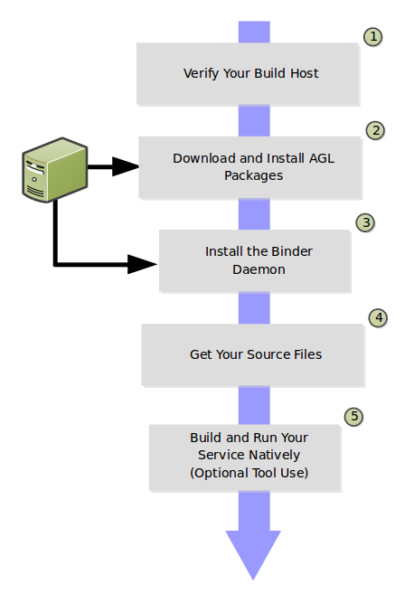

# Overview

You can develop Microservices on your native Linux machine quickly
by following the workflow in this section.
This workflow takes advantage of RPM or Debian packages,which are available
through the
[OpenSUSE Build Service (OBS)](https://build.opensuse.org/).
You can install these
[packages](https://build.opensuse.org/project/subprojects/isv:LinuxAutomotive)
and bypass the
[Yocto Project](https://yoctoproject.org) build cycles described in the
"[Developing an AGL Image](../../getting_started/reference/getting-started/image-workflow-intro.html)" section.

Using this workflow, you can start to code, execute, and debug Microservice
bindings directly on your host.  This flow works for many cases for which
no specific hardware is required, or when you can plug hardware directly
into your native Linux host's USB port such as a Controller Area Network
([CAN](https://en.wikipedia.org/wiki/CAN_bus)) bus Adapter or a Media
Oriented Systems Transport
([MOST](https://en.wikipedia.org/wiki/MOST_Bus)) Controller.

The following figure and list overview the Microservice Native Development
process.
You can learn about the steps in the process by reading through the
remaining sections.

1. **Verify Your Build Host:**
   Make sure you have a native Linux host.
   For the example used in this section (i.e. `helloworld-service`), be sure your
   Linux distribution is a recent version of Debian, Ubuntu, OpenSUSE, or Fedora.

2. **Download and Install AGL Packages:**
   Download and install the
   [near-zero](https://en.wikipedia.org/wiki/Zero_Install) packages
   from the OBS.

3. **Install the Binder Daemon:**
   Install the Binder Daemon, which is a part of the
   [AGL Application Framework (AFM)](../../apis_services/reference/af-main/0-introduction.html).
   The daemon allows you to connect applications to required services.

4. **Get Your Source Files:**
   For this section, you clone the `helloworld-service` binding repository.
   You also need to make sure you have some other required packages to build
   that specific binding.

5. **Build and Run Your Service Natively (Optional Tool Use):**
   Build your binding on your Linux host using native tools.
   Once the binding is built, you can run it to make sure it functions
   as expected.

   Optionally use extra tools once your binding is building and running
   smoothly in the native environment.
