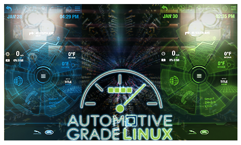

# Introduction

AGL Automotive Grade Linux Automotive Grade Linux is a collaborative open
source project that is bringing together automakers, suppliers and technology
companies to accelerate the development and adoption of a fully open software
stack for the connected car.

| *Meta* | *Data* |
| -- | -- |
| **Title** | {{ config.title }} |
| **Author** | {{ config.author }} |
| **Description** | {{ config.description }} |
| **Keywords** | {{ config.keywords }} |
| **Language** | English |
| **Published** | Published {{ config.published }} as an electronic book |
| **Updated** | {{ gitbook.time }} |
| **Collection** | Open-source |
| **Website** | [{{ config.website }}]({{ config.website }}) |
