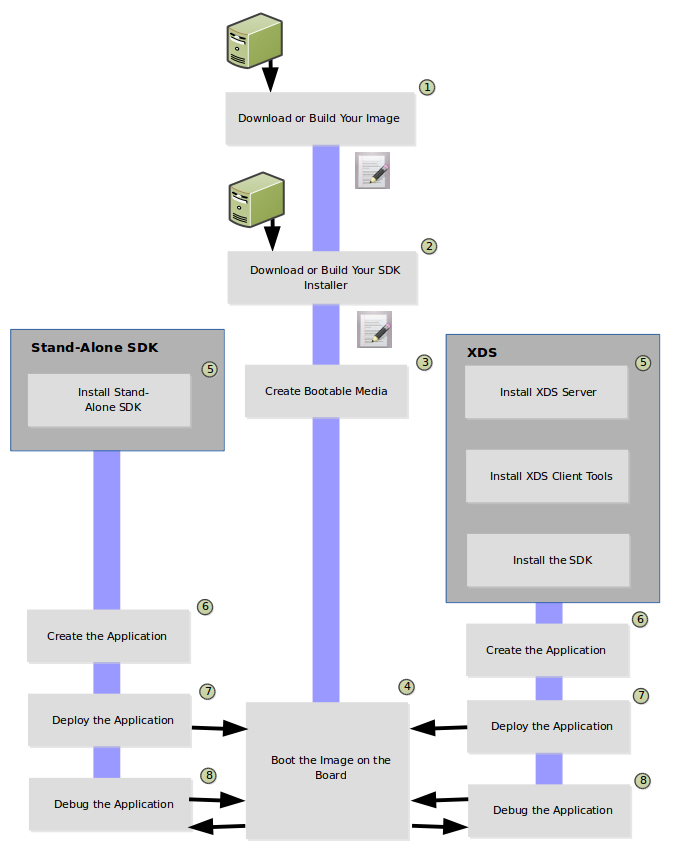

# Overview #

The application development workflow begins with securing the image
that runs on your hardware and finishes with debugging the application
as it runs on that hardware.

The following figure and list overview the application development
process.
You can learn about the steps in the process by reading through the
remaining sections.

**NOTE:** This procedure uses information from many other procedures
in the AGL Documentation set.
Links are provided when a set of steps is required that is documented
elsewhere.

1. Download or build the image you are going to run on the hardware device.

2. Download or build the Software Development Kit (SDK) you use to create your application.

3. Create bootable media using your image.

4. Boot your hardware device with the media.

5. Prepare your environment so that you can develop an application.
You can develop the application using XDS or using a stand-alone SDK.

6. Create your application.

7. Deploy the application to your hardware.

8. Debug the application.

