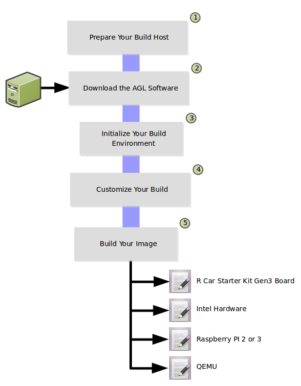

# Overview #

The AGL image development workflow consists of setting up
the system (i.e. the build host) that builds the image and finishes with
using the
[Yocto Project](https://yoctoproject.org) to create an image
targeted towards specific hardware.

The following figure and list overview the AGL image development
process.
You can learn about the steps in the process by reading through the
remaining sections.

**NOTE:** This procedure uses information from many other procedures
in the AGL Documentation set.
Links are provided when a set of steps is required that is documented
elsewhere.

1. Prepare your build host to use use the tools needed to build your image.

2. Download the AGL software into a local Git repository on your build host.

3. Run the build environment script to initialize variables and paths needed for the build.

4. Make sure your build configuration is defined exactly how you want it for your build.

5. Use
   [BitBake](https://yoctoproject.org/docs/2.4.4/bitbake-user-manual/bitbake-user-manual.html)
   to build your image.
