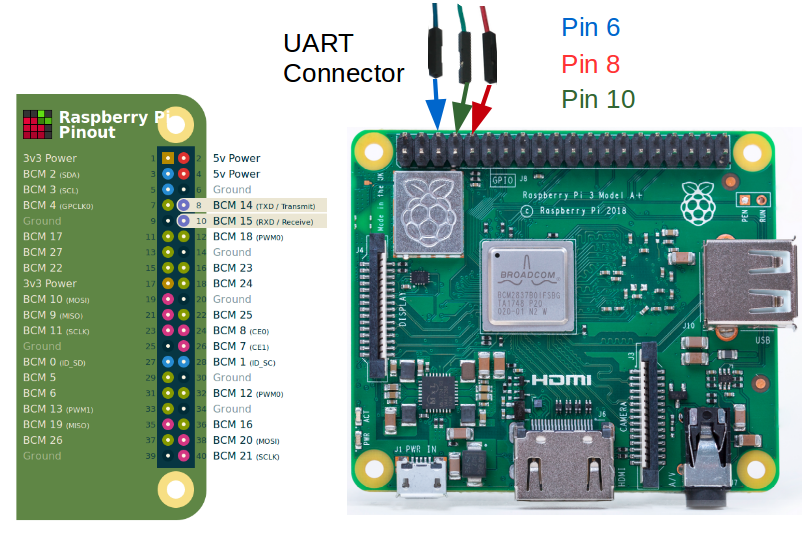

# Building for Raspberry PI 2 or 3

The
[Raspberry PI](https://www.raspberrypi.org/help/what-%20is-a-raspberry-pi/) is a small
computer that is ideal for learning computing and computer languages.
The AGL Project supports building images for the
[Raspberry PI 2](https://www.raspberrypi.org/products/raspberry-pi-2-model-b/) and the
[Raspberry PI 3](https://www.raspberrypi.org/products/raspberry-pi-3-model-a-plus/) boards.
Each of these boards comes in a variety of models.
See the
[Raspberry PI Product Page](https://www.raspberrypi.org/products/) for more information.

This section describes the steps you need to take to build the
AGL demo image for both the Raspberry PI 2 and 3 boards.

## 1. Making Sure Your Build Environment is Correct

The
"[Initializing Your Build Environment](../image-workflow-initialize-build-environment.html/Initializing-your-build-environment)"
section presented generic information for setting up your build environment
using the `aglsetup.sh` script.
If you are building the AGL demo image for a Raspberry PI board, you need to specify some
specific options when you run the script.

Use the following commands to initialize your build environment.
In each case, the "-m" option specifies the machine and the
list of AGL features used with script are appropriate for development of
the AGL demo image suited for either Raspberry PI 2 or 3:

**Raspberry PI 2**:

```bash
$ source meta-agl/scripts/aglsetup.sh -m raspberrypi2 agl-demo agl-netboot agl-appfw-smack
```

**Raspberry PI 3**:

```bash
$ source meta-agl/scripts/aglsetup.sh -m raspberrypi3 agl-demo agl-netboot agl-appfw-smack
```

## 2. Configuring the Build to Include Packages Under a Commercial License

Before launching the build, it is good to be sure your build
configuration is set up correctly (`/build/conf/local.conf` file).
The
"[Customizing Your Build](./image-workflow-cust-build.html)"
section highlights some common configurations that are useful when
building any AGL image.

For the Raspberry PI platforms, you need to take an additional
configuration step if you want to include any packages under a
commercial license.

For example, suppose you want to include an implementation of the
[OpenMAX](https://www.khronos.org/openmax/) Intagration Library
(`libomxil`) under a commercial license as part of your AGL image.
If so, you must include the following two lines in your
`/build/conf/local.conf` file:

```bash
# For libomxil
LICENSE_FLAGS_WHITELIST = "commercial"

IMAGE_INSTALL_append = " libomxil"
```

## 3. Using BitBake

This section shows the `bitbake` command used to build the AGL image.

Before running BitBake to start your build, it is good to be reminded that AGL
does provide a pre-built image for developers that want to use the Raspberry PI 3
board.
You can find this pre-built image on the
[AGL Download web site](https://download.automotivelinux.org/AGL/release).

For the supported image, the filename has the following form:

```
<release-name>/<release-number>/raspberrypi3/deploy/images/raspberrypi3/*
```


Start the build using the `bitbake` command.

**NOTE:** An initial build can take many hours depending on your
CPU and and Internet connection speeds.
The build also takes approximately 100G-bytes of free disk space.

For this example, the target is "agl-demo-platform":

```bash
$ bitbake agl-demo-platform
```

By default, the build process puts the resulting image in the Build Directory.
Here is example for the Raspberry PI 3 board:

```
<build_directory>/tmp/deploy/images/raspberrypi3/agl-demo-platform-raspberrypi3.wic.xz
```

If you build for the Raspberry PI 2 board, the location uses "raspberrypi2" in the path.

## 4. Deploying the AGL Demo Image

Deploying the AGL demo image consists of copying the image on a MicroSD card,
plugging the card into the Raspberry PI board, and then booting the board.

Follow these steps to copy the image to a MicroSD card and boot
the image on the Raspberry PI 2 or 3 board:

1. Plug your MicroSD card into your Build Host (i.e. the system that has your build output).

2. Be sure you know the MicroSD device name.

   Use the `dmesg` command as follows to discover the device name:

   ```bash
   $ dmesg | tail -4
   [ 1971.462160] sd 6:0:0:0: [sdc] Mode Sense: 03 00 00 00
   [ 1971.462277] sd 6:0:0:0: [sdc] No Caching mode page found
   [ 1971.462278] sd 6:0:0:0: [sdc] Assuming drive cache: write through
   [ 1971.463870]  sdc: sdc1 sdc2
   ```

   In the previous example, the MicroSD card is attached to the device `/dev/sdc`.

   You can also use the `lsblk` command to show all your devices.
   Here is an example that shows the MicroSD card as `/dev/sdc`:

   ```bash
   $ lsblk
     NAME   MAJ:MIN RM   SIZE RO TYPE MOUNTPOINT
     sda      8:0    0 167,7G  0 disk
     ├─sda1   8:1    0   512M  0 part /boot/efi
     ├─sda2   8:2    0 159,3G  0 part /
     └─sda3   8:3    0   7,9G  0 part [SWAP]
     sdb      8:16   0 931,5G  0 disk
     └─sdb1   8:17   0 931,5G  0 part /media/storage
     sdc      8:32   1  14,9G  0 disk
     ├─sdc1   8:33   1    40M  0 part
     └─sdc2   8:34   1   788M  0 part
   ```

   **IMPORTANT NOTE:** Before re-writing any device on your Build Host, you need to
   be sure you are actually writing to the removable MicroSD card and not some other
   device.
   Each computer is different and removable devices can change from time to time.
   Consequently, you should repeat the previous operation with the MicroSD card to
   confirm the device name every time you write to the card.

   To summarize this example so far, we have the following:

   * The first SATA drive is `/dev/sda`.

   * `/dev/sdc` corresponds to the MicroSD card, and is also marked as a removable device.
     You can see this in the output of the `lsblk` command where "1" appears in the "RM" column
     for that device.

3. Now that you know the device name, unmount the device and use the
   `xzcat` command to copy the image to the MicroSD card.

   **NOTE:** For Raspberry PI 2, the image is at `build/tmp/deploy/images/raspberrypi2/agl-demo-platform-raspberrypi2.wic.xz`.
   For Raspberry PI 3, the image is at `build/tmp/deploy/images/raspberrypi3/agl-demo-platform-raspberrypi3.wic.xz`.

   Be sure you are root, provide the actual device name for *sdcard_device_name*, and the actual
   image name for *image_name*:

   ```bash
   $ sudo umount <sdcard_device_name>
   $ xzcat <image_name> | sudo dd of=<sdcard_device_name> bs=4M
   $ sync
   ```

4. Plug your MicroSD card into the Raspberry PI board and boot the device.

## 5. Using the Raspberry PI Touch Display

If you have connected the official
[Raspberry PI Touch Display](https://www.raspberrypi.org/products/raspberry-pi-touch-display/),
you can configure the display by editing the `weston.ini` file.

Plenty of information exists on how to configure and use this touchscreen.
See the following references for more information:

* For information on where the `weston.ini` file is located, see
  [location](https://jlk.fjfi.cvut.cz/arch/manpages/man/weston.ini.5#DESCRIPTION).

* For information on the `weston.ini` file in general, see the
  [manpage](https://jlk.fjfi.cvut.cz/arch/manpages/man/weston.ini.5).

* For information on Weston, which is the reference implementation of Wayland, see
  [Wayland](https://wiki.archlinux.org/index.php/wayland).

As an example on how to configure and manipulate the touchscreen, consider
the following edits to the `weston.ini` file used to rotate the
display:

```bash
root@raspberrypi3:/etc/xdg/weston# cat weston.ini
[core]
backend=drm-backend.so
shell=desktop-shell.so

[shell]
locking=true
# Uncomment below to hide panel
#panel-location=none

[launcher]
icon=/usr/share/weston/terminal.png
path=/usr/bin/weston-terminal

[launcher]
icon=/usr/share/weston/icon_flower.png
path=/usr/bin/weston-flower

[output]
name=DSI-1
transform=270
```

## 6. Debugging

When things go wrong, you can take steps to debug your Raspberry PI.
For debugging, you need a 3.3 Volt USB Serial cable to fascilitate
communication between your Raspberry PI board and your build host.
A good cable to use is the 3.3V USB-to-Serial cable
[Olimex USB-Serial-Cable-F](https://www.olimex.com/Products/Components/Cables/USB-Serial-Cable/USB-Serial-Cable-F/).

**NOTE:** If you are using a USB console cable from Adafruit, see
"[Adafruit's Raspberry Pi Lesson 5](https://learn.adafruit.com/adafruits-raspberry-pi-lesson-5-using-a-console-cable/connect-the-lead)"
for connection information.

Use the following steps, which assume you are using the previously mentioned
Olimex cable.
You can reference the following diagram for information on the following steps:

<p align="center">
  
</p>

1. Connect the Olimex cable to the Universal Asynchronous Receiver-Transmitter
   (UART) connection on your Raspberry PI board.
   Do not connect the USB side of the cable to your build host at this time.

   **CAUTION:** No warranty is provided using the following procedure.
   Pay particular attention to the collors of your cable as they could
   vary depending on the vendor.

2. Connect the cable's BLUE wire to pin 6 (i.e. Ground) of the UART.

3. Connect the cable's GREEN RX line to pin 8 (i.e. the TXD line) of
   the UART.

4. Connect the cable's RED TX line to pin 10 (i.e. the RXD line) of
   the UART.

5. Plug the USB connector of the cable into your build host's USB port.

6. Use your favorite tool for serial communication between your build host
   and your Raspberry PI.
   For example, if your build host is a native Linux machine (e.g. Ubuntu)
   you could use `screen` as follows from a terminal on the build host:

   ```bash
   $ sudo screen /dev/ttyUSB0 115200
   ```
