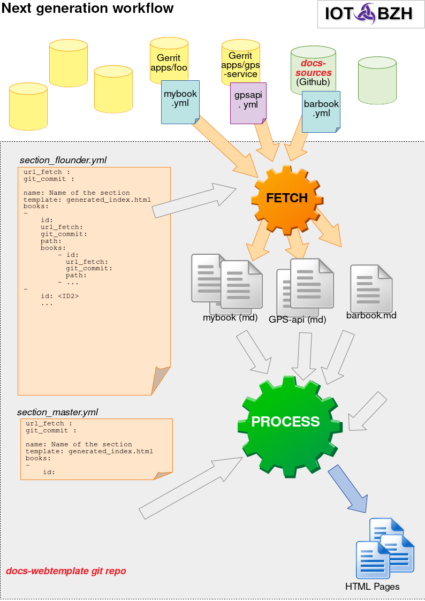

# Abstract

AGL doc website is based on a collection of markdown files fetched from various repositories.
A tool available in [docs-tools](https://github.com/automotive-grade-linux/docs-tools) takes
care of collecting and templating all markdown files according fetched_files.yml located in
[docs-webtemplate](https://github.com/automotive-grade-linux/docs-webtemplate).

See below a scheme of the workflow of agl documentation website generation.

As you can see, the section_``version``.yml contains the links to all the book yaml files, it is proceed to fetch all book yaml files from remote repositories to the docs-webtemplate. The book yaml files contains all the url to your markdown files from the remote repository.

As soon as all the markdown files are fetched, the tools process to generate the AGL doc website.

---

**Note:**

The images described in markdown files are automatically fetched. For that, the necessary condition is that in markdown files, the relative path has to match with the location of images.

---

