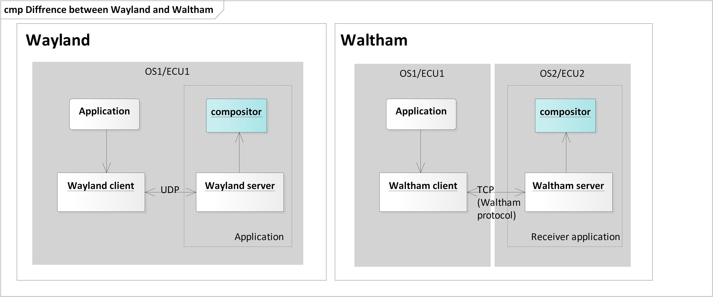

**Table of Content**

1. TOC
{:toc}

## Context

In today's world, the information for drivers is becoming excessive. For example, safety information to let driver notice the obstacles on the road, telematics information about car accident or traffic jam, media information from connected phones etc. In the future world, it is expected that the more displays will be available in the car and show more information. TFT Cluster will have more information other than engine speed and map, Head-Up-Display on windshield will bring driver to new world. 
However, too much information would make drivers confused. We need more comprehensive Human Machine Interface, which displays the information what the driver needs on appropriate place and time with comprehensive user interface design. To conclude, Graphics sharing between multiple ECUs is necessary. Waltham protocol is developed for this purpose.

## Waltham protocol

[Waltham protocol](https://github.com/waltham/waltham) is a network IPC library of [Wayland](https://wayland.freedesktop.org) developed by Collabora along with ADIT, a joint venture company owned by Robert Bosch Car Multimedia GmbH and DENSO corporation. It supports surface sharing via network, but sharing function itself is not implemented in Waltham.  
Please refer [Waltham documentation](https://waltham.github.io/waltham/) for more details. 

### Major differences from Wayland to Waltham
- Waltham uses TCP sockets for reliable communication  
- Waltham cannot send file descriptors
- Waltham API is minimal and symmetric between server and client sides
- Waltham does not provide an event loop implementation
- The registry implementation is left out of the library, only the interface is provided
- No multi-threading support for sharing objects between threads

### Requirements in automotive industry
In order to use Waltham in automotive industry, the automotive specific requirements must be covered.  

The below shows very high level requirements. You can find the further requirements at [i**Waltham Requirements**](https://confluence.automotivelinux.org/display/UIGRA/Waltham+backend+requirements).

1. Shall be able to support fast/reliable remoting among multiple ECUs
2. Shall be able to support input handling
3. Shall be able to share dedicated application
4. Shall be able to share complete display output depending on additional communication

* Surface sharing is not part of Waltham protocol, Each system needs to implement the most efficient way for surface sharing. 
On AGL, we implemented [Waltham client and Receiver](1-waltham-client-and-receiver.md) to enable surface sharing along with GStreamer encoder/decoder. It uses UDP for remoting, which is faster than TCP. Input events communicates with Waltham protocol.

### Links
* [Announcement of Waltham](https://lists.freedesktop.org/archives/wayland-devel/2016-October/031413.html)
* [Bi-weekly meeting minutes](https://wiki.automotivelinux.org/eg-ui-graphics)
* [UI and Graphics wiki](https://confluence.automotivelinux.org/display/UIGRA/UI+and+Graphics+Home)
* [Waltham source codes](https://gerrit.automotivelinux.org/gerrit/gitweb?p=src/weston-ivi-plugins.git;a=tree;h=refs/heads/master;hb=refs/heads/master)
