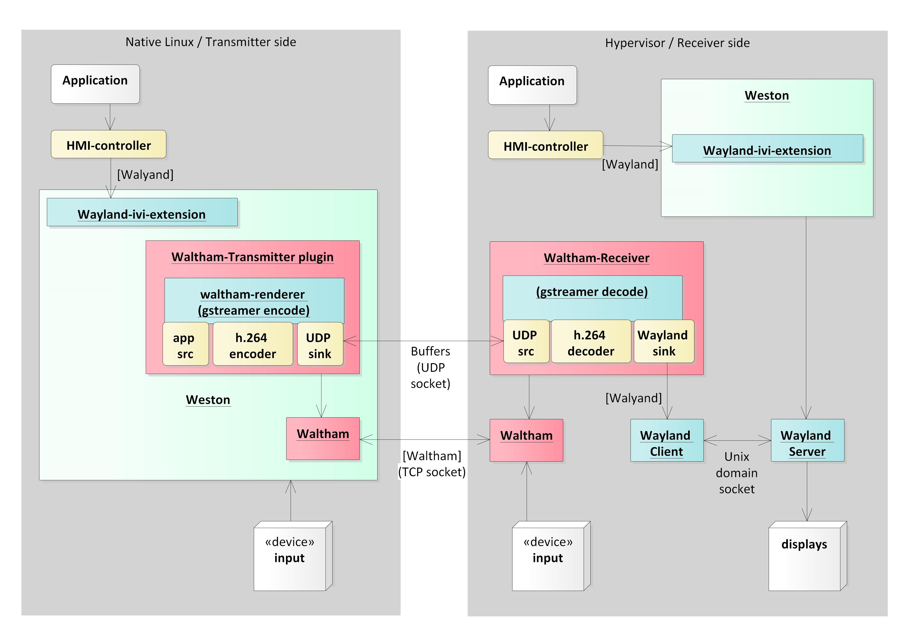

**Table of Content**

1. TOC
{:toc}

## waltham-client-server-applications

### waltham-client
waltham-client uses Waltham IPC library to connect to remote and transmit client buffers using GStreamer framework. It is designed for AGL upon certain Linux base system with wayland backend.

waltham-client is divided into two components:

* waltham-transmitter plugin: 
    waltham-transmitter plugin provides API to create remote connections and push surfaces over the network and handles both remote output and remote input.

* waltham-renderer: 
    waltham-renderer is the implementation for sharing surface. It creates a buffer to be transmitted to other domain. Latest implementation uses GStreamer framework. 

### waltham-receiver

waltham-receiver is a sample implementation of receiver app which shall be running at remote side. It is developed based on [waltham server](https://github.com/waltham/waltham/tree/master/tests), using Waltham protocol to obtain and process remote output which is sent by waltham-transmitter.
This component is designed to be used for evaluating the functionalities of waltham-transmitter plugin.

## How it works

1. Loading and initialization

The system launches Weston, then Weston loads waltham-transmitter plugin. waltham-client connects to receiver app at remote side during initialization.  

2. Establishing connection

At transmitter_create_remote(), waltham-transmitter creates "struct weston_transmitter_remote" which expresses the receiver object at remote side. Therefore this structure is created for each receiver.   
waltham-transmitter sends wth_display_get_registry() and wth_display_sync message() to the receiver app as same manner as Wayland protocol. So that receiver app sends back the resource list to waltham-transmitter.

3. Forwarding surface 

During Weston redraws surface as waltham-transmitter output, waltham-transmitter sends waltham protocol messages to receiver app to notify surface update. wthp_surface_attach(), wthp_surface_damage() and wthp_surface_commit() which correspond to wl_surface_attach(), wl_surface_damage() and wl_surface_commit() message in wayland protocol. 
wthp_surface_attach() - Send wthp_buffer as a buffer handling. This is not the actual buffer which contains the data to be rendered but the handle of actual buffer. It abstracts the differences of buffer type.
wthp_surface_damage() - Tell the updated region to receiver app. 
wthp_surface_commit() - Tell surface gets updated to receiver app.

4. Rendering using GStreamer

5. Input handling

For handling input events, waltham-transmitter has 2 ways to secure seat. 
	1. Usse wl_seat as weston has. 
	2. Create new wl_seat.  
Second case is applicable in case transmitter side doesn’t have input device but receiver at remote side has. After wl_seat is created, waltham-transmitter sends input events to weston client application when it gets input event from receiver via waltham protocol. 
The message wthp_send_XXX shows you that input event is forwarded from receiver to transmitter, XXX is filled by input event name.

6. Retry connection

In case the connection gets disconnected during surface sharing, waltham-transmitter shall re-establish the connection. The object “struct waltham_display” represents the connection between the transmitter and receiver, which structure has the flag used to detect disconnection named “running”. In function “connection_handle_data()”, running is set to "false" in case disconnection detected. This flag is checked at every “transmitter_surface_gather_state". When running is false state, waltham-transmitter starts retry handling sequence. First of all, It release the waltham protocol objects then goes to Establish connection sequence mentioned in "2. Establishing connection".

## Waltham in practice
Here is the example how waltham can be used in hypervisor use case of real project .
* Weston is used as the wayland compositor.
* waltham-client is implemented for Weston which acts as a Waltham  virtual display.
* Application surface is assigned to Waltham virtual display and it's sent to the other ECU/OS. 
  Buffers of surface are transferred via GStreamer(UDP), since transferring raw pixel data via Waltham(TCP) is not enough fast.
* Controlling input events (pointer, keyboard, touch) for the surface is handled by Waltham.

## How Waltham can be integrated
Here are possible integration examples of waltham.

### As EGL backend (theoretical possibility)

Similar to Wayland backend for EGL, Waltham client could be backend in compositer. /                                                                                                        
For good performance, a generic surface sharing mechanism is needed in hypervisor environment.  
Applications need to adapt to Waltham. Waltham is not designed with this use in mind. This usage is just a theoretical possibility.

### As GStreamer sink (theoretical possibility)

Similar to Wayland sink, Waltham sink GStreamer plugin can be implemented which sends the buffers to receiver on another domain/OS.  
Waltham sink can utilize frame sync and presentation feedback protocols for video synchronization.  
For good performance, a generic surface sharing mechanism is needed in hypervisor environment.  
Waltham is not designed with this use in mind. This usage is just a theoretical possibility.

### As virtual display in compositor

Virtual display plugin can be implemented in compositor. This plugin sends client buffers to waltham-receiver in another domain.  
No changes to applications.   
For good performance, a generic surface sharing mechanism is needed in hypervisor environment.  
This is the intended use in mind during design.

